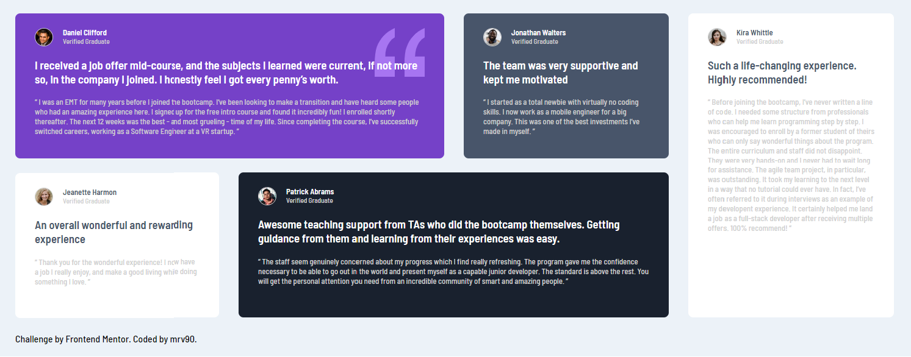

# Frontend Mentor - Testimonials grid section solution
 This is a solution to the [Testimonials grid section challenge on Frontend Mentor](https://www.frontendmentor.io/challenges/testimonials-grid-section-Nnw6J7Un7). Frontend Mentor challenges help you improve your coding skills by building realistic projects.
  
## Table of contents
- [Overview](#overview)
- [The challenge](#the-challenge)
- [Screenshot](#screenshot)
- [Links](#links)
- [What I learned](#what-i-learned)

## Overview
### The challenge

Users should be able to:
- View the optimal layout for the site depending on their device's screen size

### Links 
- Solution URL: [Solution URL](https://github.com/mrv90/frontend-mentor_testimonials-grid-section)
- Live Site URL: [Live site URL](https://mrv90.github.io/frontend-mentor_testimonials-grid-section/)

## My process
### Built with
- Semantic HTML5 markup
- CSS custom properties
- Flexbox
- CSS Grid
- Mobile-first workflow

### What I learned
 - Using CSS Grid: I have some experience in the past and that, helped my pass this challenge!
 - When the value of 'auto' works and when it's not! Commonly on "margin" and "padding"
